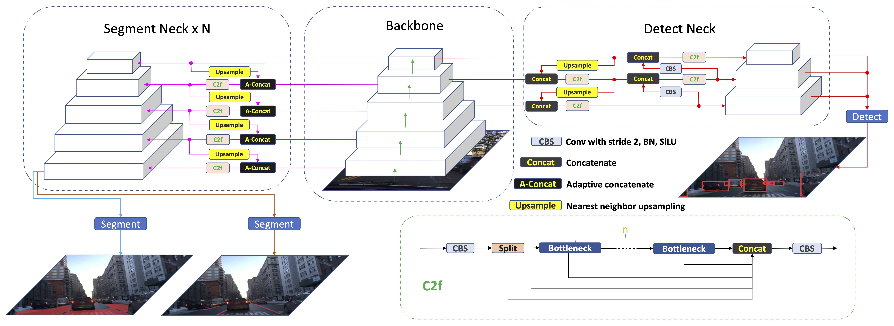
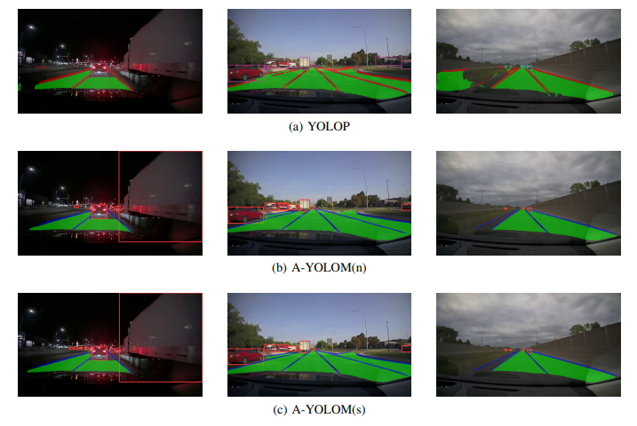

<div align="left">   


## You Only Look at Once for Real-time and Generic Multi-Task
This repository(Yolov8 multi-task) is the official PyTorch implementation of the paper "You Only Look at Once for Real-time and Generic Multi-Task".  

> [**You Only Look at Once for Real-time and Generic Multi-Task**](https://ieeexplore.ieee.org/document/10509552)
>
> by [Jiayuan Wang](https://scholar.google.ca/citations?user=1z6x5_UAAAAJ&hl=zh-CN&oi=ao), [Q. M. Jonathan Wu](https://scholar.google.com/citations?user=BJSAsE8AAAAJ&hl=zh-CN)<sup> :email:</sup> and [Ning Zhang](https://scholar.google.ca/citations?hl=zh-CN&user=ZcYihtoAAAAJ)
>
>  (<sup>:email:</sup>) corresponding author.
>
> *[IEEE Transactions on Vehicular Technology](https://ieeexplore.ieee.org/document/10509552)*

---

### The Illustration of A-YOLOM



### Contributions

* We have developed a lightweight model capable of integrating three tasks into a single unified model. This is particularly beneficial for multi-task that demand real-time processing.
* We have designed a novel Adaptive Concatenate Module specifically for the neck region of segmentation architectures. This module can adaptively concatenate features without manual design, further enhancing the model's generality.
* We designed a lightweight, simple, and generic segmentation head. We have a unified loss function for the same type of task head, meaning we don't need to custom design for specific tasks. It is only built by a series of convolutional layers.
* Extensive experiments are conducted based on publicly accessible autonomous driving datasets, which demonstrate that our model can outperform existing works, particularly in terms of inference time and visualization. Moreover, we further conducted experiments using real road datasets, which also demonstrate that our model significantly outperformed the state-of-the-art approaches.

### Results

#### Parameters and speed
| Model          | Parameters  | FPS (bs=1) | FPS (bs=32) |
|----------------|-------------|------------|-------------|
| YOLOP          | 7.9M        | 26.0       | 134.8       |
| HybridNet      | 12.83M      | 11.7       | 26.9        |
| YOLOv8n(det)   | 3.16M       | 102        | 802.9       |
| YOLOv8n(seg)   | 3.26M       | 82.55      | 610.49      |
| A-YOLOM(n)     | 4.43M       | 39.9       | 172.2       |
| A-YOLOM(s)     | 13.61M      | 39.7       | 96.2        |


#### Traffic Object Detection Result

| Model       | Recall (%) | mAP50 (%) |
|-------------|------------|------------|
| MultiNet    | 81.3       | 60.2       |
| DLT-Net     | **89.4**   | 68.4       |
| Faster R-CNN| 81.2       | 64.9       |
| YOLOv5s     | 86.8       | 77.2       |
| YOLOv8n(det)| 82.2       | 75.1       |
| YOLOP       | 88.6       | 76.5       |
| A-YOLOM(n)  | 85.3       | 78.0       |
| A-YOLOM(s)  | 86.9       | **81.1**   |

#### Drivable Area Segmentation Result

| Model          | mIoU (%) |
|----------------|----------|
| MultiNet       | 71.6     |
| DLT-Net        | 72.1     |
| PSPNet         | 89.6     |
| YOLOv8n(seg)   | 78.1     |
| YOLOP          | **91.6** |
| A-YOLOM(n)     | 90.5     |
| A-YOLOM(s)     | 91.0     |


#### Lane Detection Result:

| Model          | Accuracy (%) | IoU (%) |
|----------------|--------------|---------|
| Enet           | N/A          | 14.64   |
| SCNN           | N/A          | 15.84   |
| ENet-SAD       | N/A          | 16.02   |
| YOLOv8n(seg)   | 80.5         | 22.9    |
| YOLOP          | 84.8         | 26.5    |
| A-YOLOM(n)     | 81.3         | 28.2    |
| A-YOLOM(s)     | **84.9**     | **28.8** |


#### Ablation Studies 1: Adaptive concatenation module:

| Training method | Recall (%) | mAP50 (%) | mIoU (%) | Accuracy (%) | IoU (%) |
|-----------------|------------|-----------|----------|--------------|---------|
| YOLOM(n)        | 85.2       | 77.7      | 90.6     | 80.8         | 26.7    |
| A-YOLOM(n)      | 85.3       | 78        | 90.5     | 81.3         | 28.2    |
| YOLOM(s)        | 86.9       | 81.1      | 90.9     | 83.9         | 28.2    |
| A-YOLOM(s)      | 86.9       | 81.1      | 91       | 84.9         | 28.8    |


#### Ablation Studies 2: Results of different Multi-task model and segmentation structure:

| Model          | Parameters | mIoU (%) | Accuracy (%) | IoU (%) |
|----------------|------------|----------|--------------|---------|
| YOLOv8(segda)  | 1004275    | 78.1     | -            | -       |
| YOLOv8(segll)  | 1004275    | -        | 80.5         | 22.9    |
| YOLOv8(multi)  | 2008550    | 84.2     | 81.7         | 24.3    |
| YOLOM(n)       | 15880      | 90.6     | 80.8         | 26.7    |

YOLOv8(multi) and YOLOM(n) only display two segmentation head parameters in total. They indeed have three heads, we ignore the detection head parameters because this is an ablation study for segmentation structure.


  
**Notes**: 

- The works we has use for reference including `Multinet`  ([paper](https://arxiv.org/pdf/1612.07695.pdf?utm_campaign=affiliate-ir-Optimise%20media%28%20South%20East%20Asia%29%20Pte.%20ltd._156_-99_national_R_all_ACQ_cpa_en&utm_content=&utm_source=%20388939),[code](https://github.com/MarvinTeichmann/MultiNet)）,`DLT-Net`   ([paper](https://ieeexplore.ieee.org/abstract/document/8937825)）,`Faster R-CNN`  ([paper](https://proceedings.neurips.cc/paper/2015/file/14bfa6bb14875e45bba028a21ed38046-Paper.pdf),[code](https://github.com/ShaoqingRen/faster_rcnn)）,`YOLOv5s`（[code](https://github.com/ultralytics/yolov5))  ,`PSPNet`([paper](https://openaccess.thecvf.com/content_cvpr_2017/papers/Zhao_Pyramid_Scene_Parsing_CVPR_2017_paper.pdf),[code](https://github.com/hszhao/PSPNet)) ,`ENet`([paper](https://arxiv.org/pdf/1606.02147.pdf),[code](https://github.com/osmr/imgclsmob))    `SCNN`([paper](https://www.aaai.org/ocs/index.php/AAAI/AAAI18/paper/download/16802/16322),[code](https://github.com/XingangPan/SCNN))    `SAD-ENet`([paper](https://openaccess.thecvf.com/content_ICCV_2019/papers/Hou_Learning_Lightweight_Lane_Detection_CNNs_by_Self_Attention_Distillation_ICCV_2019_paper.pdf),[code](https://github.com/cardwing/Codes-for-Lane-Detection)), `YOLOP`([paper](https://link.springer.com/article/10.1007/s11633-022-1339-y),[code](https://github.com/hustvl/YOLOP)), `HybridNets`([paper](https://arxiv.org/abs/2203.09035),[code](https://github.com/datvuthanh/HybridNets)), `YOLOv8`([code](https://github.com/ultralytics/ultralytics)). Thanks for their wonderful works.


---

### Visualization

#### Real Road



---


### Requirement

This codebase has been developed with [**Python==3.7.16**](https://www.python.org/) with [**PyTorch==1.13.1**](https://pytorch.org/get-started/locally/).

You can use a 1080Ti GPU with 16 batch sizes. That will be fine. Only need more time to train. We recommend using a 4090 or more powerful GPU, which will be fast. 

We strongly recommend you create a pure environment and follow our instructions to build yours. Otherwise, you may encounter some issues because the YOLOv8 has many mechanisms to detect your environment package automatically. Then it will change some variable values to further affect the code running. 

```setup
cd YOLOv8-multi-task
pip install -e .
```

### Data preparation and Pre-trained model

#### Download

- Download the images from [images](https://bdd-data.berkeley.edu/).

- Pre-trained model: [A-YOLOM](https://uwin365-my.sharepoint.com/:f:/g/personal/wang621_uwindsor_ca/EnoHyXIbTGFDjv1KLccuvrsBWLz6R4_TNVxErMukwCL0mw?e=I8WcKc) # which include two version, scale "n" and "s".
  
- Download the annotations of detection from [detection-object](https://uwin365-my.sharepoint.com/:u:/g/personal/wang621_uwindsor_ca/EflGScMT-D1MqBTTYUSMdaEBT1wWm5uB8BausmS7fDLsQQ?e=cb7age). 
- Download the annotations of drivable area segmentation from [seg-drivable-10](https://uwin365-my.sharepoint.com/:u:/g/personal/wang621_uwindsor_ca/EWyIyXDFCzRLhERniUiuyIABq257WF4DbNJBDB8Dmok91w?e=hgWtoZ). 
- Download the annotations of lane line segmentation from [seg-lane-11](https://uwin365-my.sharepoint.com/:u:/g/personal/wang621_uwindsor_ca/EUBQBO2KGFtHsexik3WvLZMBuaW1CsnHDTZo5eJ3ESdJNA?e=K6Tsem). 

We recommend the dataset directory structure to be the following:

```
# The id represent the correspondence relation
├─dataset root
│ ├─images
│ │ ├─train2017
│ │ ├─val2017
│ ├─detection-object
│ │ ├─labels
│ │ │ ├─train2017
│ │ │ ├─val2017
│ ├─seg-drivable-10
│ │ ├─labels
│ │ │ ├─train2017
│ │ │ ├─val2017
│ ├─seg-lane-11
│ │ ├─labels
│ │ │ ├─train2017
│ │ │ ├─val2017
```

Update the your dataset path in the `./ultralytics/datasets/bdd-multi.yaml`.

### Training

You can set the training configuration in the `./ultralytics/yolo/cfg/default.yaml`.


```
python train.py
```
You can change the setting in train.py

```python
# setting

sys.path.insert(0, "/home/jiayuan/ultralytics-main/ultralytics")
# You should change the path to your local path to "ultralytics" file
model = YOLO('/home/jiayuan/ultralytics-main/ultralytics/models/v8/yolov8-bdd-v4-one-dropout-individual.yaml', task='multi')
# You need to change the model path for yours.
# The model files saved under "./ultralytics/models/v8" 
model.train(data='/home/jiayuan/ultralytics-main/ultralytics/datasets/bdd-multi-toy.yaml', batch=4, epochs=300, imgsz=(640,640), device=[4], name='v4_640', val=True, task='multi',classes=[2,3,4,9,10,11],combine_class=[2,3,4,9],single_cls=True)
```
- data: Please change the "data" path to yours. You can find it under "./ultralytics/datasets"

- device: If you have multi-GPUs, please list your GPU numbers, such as [0,1,2,3,4,5,6,7,8]

- name: Your project name, the result and trained model will save under "./ultralytics/runs/multi/Your Project Name"

- task: If you want to use the Multi-task model, please keep "multi" here

- classes: You can change this to control which classfication in training, 10 and 11 means drivable area and lane line segmentation. You can create or change dataset map under "./ultralytics/datasets/bdd-multi.yaml"

- combine_class: means the model will combine "classes" into one class, such as our project combining the "car", "bus", "truck", and "train" into "vehicle".

- single_cls: This will combine whole detection classes into one class, for example, you have 7 classes in your dataset, and when you use "single_cls", it will automatically combine them into one class. When you set single_cls=False or delete the single_cls from model.train(). Please follow the below Note to change the "tnc" in both dataset.yaml and model.yaml, "nc_list" in dataset.yaml, the output of the detection head as well. 


### Evaluation

You can set the evaluation configuration in the `./ultralytics/yolo/cfg/default.yaml`


```
python val.py
```
You can change the setting in val.py

```python
# setting

sys.path.insert(0, "/home/jiayuan/yolom/ultralytics")
# The same with train, you should change the path to yours.

model = YOLO('/home/jiayuan/ultralytics-main/ultralytics/runs/best.pt')
# Please change this path to your well-trained model. You can use our provide the pre-train model or your model under "./ultralytics/runs/multi/Your Project Name/weight/best.pt"
metrics = model.val(data='/home/jiayuan/ultralytics-main/ultralytics/datasets/bdd-multi.yaml',device=[3],task='multi',name='val',iou=0.6,conf=0.001, imgsz=(640,640),classes=[2,3,4,9,10,11],combine_class=[2,3,4,9],single_cls=True)
```
- data: Please change the "data" path to yours. You can find it under "./ultralytics/datasets"
- device: If you have multi-GPUs, please list your GPU numbers, such as [0,1,2,3,4,5,6,7,8]. We do not recommend you use multi-GPU in val because usually, one GPU is enough.
- speed: If you want to calculate the FPS, you should set "speed=True". This FPS calculation method reference from `HybridNets`([code](https://github.com/datvuthanh/HybridNets))
- single_cls: should keep the same bool value with training. 

### Prediction

```
python predict.py
```
You can change the setting in predict.py

```python
# setting 

sys.path.insert(0, "/home/jiayuan/ultralytics-main/ultralytics")
number = 3 #input how many tasks in your work, if you have 1 detection and 3 segmentation tasks, here should be 4.
model = YOLO('/home/jiayuan/ultralytics-main/ultralytics/runs/best.pt')  
model.predict(source='/data/jiayuan/dash_camara_dataset/daytime', imgsz=(384,672), device=[3],name='v4_daytime', save=True, conf=0.25, iou=0.45, show_labels=False)
# The predict results will save under "runs" folder
```

PS: If you want to use our provided pre-trained model, please make sure that your input images are (720,1280) size and keep "imgsz=(384,672)" to achieve the best performance, you can change the "imgsz" value, but the results maybe different because he is different from the training size.

- source: Your input or want to predict images folder.
- show_labels=False: close the display of the labels. Please keep in mind, when you use a pre-trained model with "single cell=True", labels will default to display the first class name instead.
- boxes=False: close the bos for segmentation tasks.


### Note
- This code is easy to extend the tasks to any multi-segmentation and detection tasks, only need to modify the model yaml and dataset yaml file information and create your dataset follows our labels format, please keep in mind, you should keep "det" in your detection tasks name and "seg" in your segmentation tasks name. Then the code will be working. No need to modify the basic code, We have done the necessary work in the basic code.

- Please keep in mind, when you change the detection task number of classes, please change the "tnc" in dataset.yaml and modle.yaml. "tcn" means the total number of classes, including detection and segmentation. Such as you have 7 classes for detection, 1 segmentation and another 1 segmentation. "tnc" should be set to 9.

  - "nc_list" also needs to update, it should match your "labels_list" order. Such as detection-object, seg-drivable, seg-lane in your "labels_list". Then "nc_list" should be [7,1,1]. That means you have 7 classes in detection-object, 1 class in drivable segmentation, and 1 class in lane segmentation. 

  - You also need to change the detection head output numbers, that in model.yaml, such as "  - [[15, 18, 21], 1, Detect, [int number for detection class]]  # 36 Detect(P3, P4, P5)", please change "int number for detection class" to your number of classes in your detection tasks, follow above examples, here should be 7.

- If you want to change some basic code to implement your idea. Please search the "###### Jiayuan" or "######Jiayuan", We have changed these parts based on `YOLOv8`([code](https://github.com/ultralytics/ultralytics)) to implement multi-task in a single model.


## Citation

If you find our paper and code useful for your research, please consider giving a star :star:   and citation :pencil: :

```BibTeX
@ARTICLE{wang2024you,
  author={Wang, Jiayuan and Wu, Q. M. Jonathan and Zhang, Ning},
  journal={IEEE Transactions on Vehicular Technology}, 
  title={You Only Look at Once for Real-Time and Generic Multi-Task}, 
  year={2024},
  pages={1-13},
  keywords={Multi-task learning;panoptic driving perception;object detection;drivable area segmentation;lane line segmentation},
  doi={10.1109/TVT.2024.3394350}}
```
